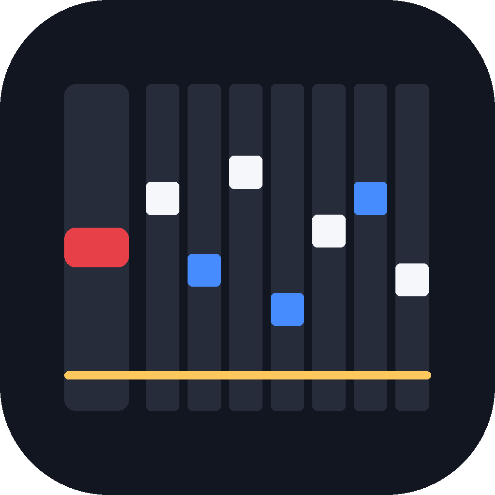

<div align="center">
  
  <h1>beatoraja — Apple Silicon</h1>
  <p>A native LWJGL3 desktop backend for beatoraja. Runs on Apple Silicon without Rosetta.</p>
</div>

---

## Why

[beatoraja](https://github.com/exch-bms2/beatoraja) is the mainstream BMS player, but it is built on libGDX 1.9.9 with the **LWJGL 2** backend. LWJGL 2 has been unmaintained since 2016 and has never supported arm64 macOS, so on Apple Silicon it can only run as x86_64 under Rosetta. That costs you:

- **Crashes.** `SIGSEGV` inside `AppleMetalOpenGLRenderer` on the texture path (`glClear → gldClearFramebufferData → GLDTextureRec::getTextureResource`), triggered by BGA video decoding. Pressing Play quits the game.
- **Dropped keysounds and stutter.** Decoding 1572 Vorbis slices takes 2–3 minutes under Rosetta while the chart itself is 124 seconds long, so the song ends before its keysounds finish loading. See upstream [issue #851](https://github.com/exch-bms2/beatoraja/issues/851), still open.

Going native removes both at the source.

## Credit

This repository is three layers of work stacked on top of each other, all GPL-3.0:

| Layer | Source | Contribution |
|---|---|---|
| Original | [exch-bms2/beatoraja](https://github.com/exch-bms2/beatoraja) | The BMS player itself |
| **The hard part** | [starxh-1/beatoraja-Android](https://github.com/starxh-1/beatoraja-Android) | **Migrated core to libGDX 1.14 and made it backend-agnostic** |
| This repository | — | The `desktop/` module (LWJGL3 backend) and a few core fixes |

**The difficult work is not ours.** Porting from upstream directly would mean crossing seven years of libGDX API drift alone — the Application classes, the configuration classes, input moving from `org.lwjgl.input.Keyboard` to GLFW, and a major-version break in gdx-controllers. `starxh-1` had already done that migration to get beatoraja onto Android. This repository only adds a desktop backend to that backend-agnostic core. Without the prior work it could not exist.

## Apple platform support

| Item | Status |
|---|---|
| Apple Silicon (arm64) native | Yes — no Rosetta, `os.arch=aarch64` |
| macOS 26 / 27 | Tested on macOS 27, M3 |
| Intel Mac (x86_64) | Untested; should work, libGDX 1.14 ships both natives |
| Retina / HiDPI | Handled (framebuffer vs. logical pixels) |
| BGA video | Yes, via `gdx-video-lwjgl3` |
| Game controllers | Untested |

## Measurements

Native arm64, libGDX 1.14, LWJGL3 OpenAL. Test chart: Katakoi Echo, 1572 ogg slices, 124 seconds long.

```
decode + load   1572 slices -> 1396 ms (0.9 ms each), 0 failures
concurrency     1920 play triggers -> 0 voices rejected
in actual play  1102 keysounds loaded in 316 ms
```

Load time is negligible against the chart length, so the Rosetta dropout problem cannot occur here.

Reproduce it yourself:

```bash
./gradlew :desktop:audioBench -Poraja.songdir=<a chart directory containing .ogg files>
```

## Running

```bash
./gradlew :desktop:run
```

Defaults to `~/Games/beatoraja0.8.8-modernchic`; change `workingDir` in `desktop/build.gradle`.

Override the frame cap with `-Doraja.fps=120`.

### Building a native .app

```bash
./gradlew :desktop:packageApp
```

Produces `desktop/build/jpackage/beatoraja.app` with an embedded JRE — double-click to run, no system Java required.

### Song database compatibility

**This fork's `SongUtils.crc32` is not compatible with a `songdata.db` built by upstream beatoraja 0.8.8.** The same directory hashes to a different CRC, so sharing one database makes the folder hierarchy mismatch and every chart disappear.

The desktop build reads `songdata-desktop.db`, falling back to `songdata.db` if absent. The original database is left untouched and both can coexist. Migrating means recomputing `folder.parent`, `song.folder` and `song.parent` with this fork's algorithm.

Song scanning is not implemented yet, so the database currently has to be built by upstream beatoraja and then migrated.

## What this repository changes

### New `desktop/` module

- `DesktopLauncher` — LWJGL3 entry point
- `JdbcSongDatabaseAccessor` — JDBC song database reader
- `StubScoreDatabaseAccessor` — score database stub, not implemented
- `AudioBenchmark` — the audio verification above

### Core fixes

1. **`SkinLoader.normalizePath()`** decided whether to prepend a leading slash from whether the *input* was absolute, but `getCanonicalPath()` had already made the path absolute. A relative path went in and an absolute path missing its leading slash came out, which was then resolved against the CWD, doubling the root and failing every texture load — a black screen.
2. **`SkinLoader.getPath()`** treated "absolute" as starting with `/storage/` or `/Android/`, so `/Users` on macOS lost its leading slash. Now Android-only.
3. **`MainController` viewport** — `glViewport` takes framebuffer pixels, which are 2× the logical size on Retina. Using `getWidth()` confined rendering to the bottom-left quadrant.

### Launcher settings that matter

- `-XstartOnFirstThread` is required by GLFW but **deadlocks** the upstream JavaFX config window. It applies to this module only.
- **OpenAL simultaneous sources must be raised explicitly.** libGDX defaults to 16, which drops keysounds on dense charts. beatoraja's own `audio.deviceSimultaneousSources` only affects its upper layer; the hard limit is `Lwjgl3ApplicationConfiguration.setAudioConfig()`.
- **Do not request a GL core profile.** libGDX and beatoraja shaders use GLSL 1.20 syntax (`varying`/`attribute`), which fails to compile there.
- The `.app` uses its own launch script rather than the jpackage launcher, because jpackage cannot set a working directory and Finder starts apps with `CWD=/`, which breaks every relative path in core.

## TODO

- [ ] **Score database** — currently a stub, scores are not saved
- [ ] **Song scanning** — not implemented
- [ ] **Config window** — the upstream JavaFX launcher has not been adapted
- [ ] **Skin switching** — needs in-game verification
- [ ] **Frame pacing** — vsync is not reliably honoured on macOS in windowed mode; currently capped explicitly
- [ ] **Intel Mac verification**
- [ ] **Controller support verification**

## License

GPL-3.0, same as upstream and the Android fork.

The upstream Android README is kept as [README-android.md](README-android.md).

---

<sub>The porting work in this repository was done with Claude (Opus 5).</sub>
